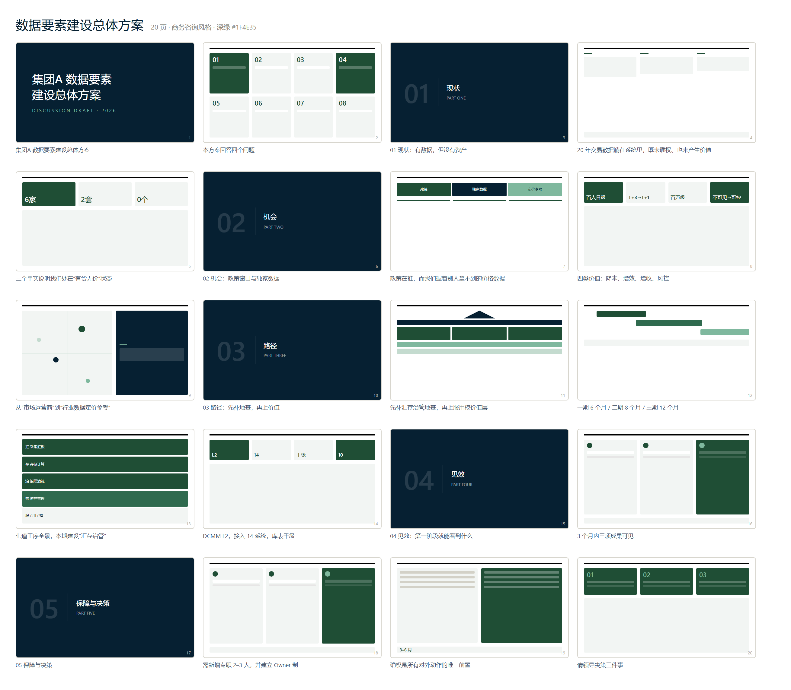
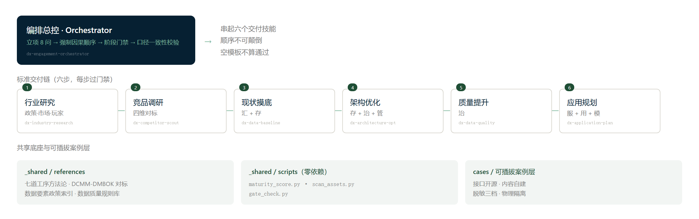

# data-element-dx-skillkit

<p align="center">
  <b>数据要素 × 传统集团数字化转型 · 端到端交付型 SKILL 套件</b><br />
  <sub>An end-to-end delivery skill suite for the data-element transformation of China's traditional / state-owned conglomerates</sub>
</p>

<p align="center">
  
  
  
  
  <br />
  <sub><b>面向中国国企与线下平台型集团</b>的数据要素转型交付套件 —— 不是教程，是能直接交给董事长的东西。</sub>
</p>

---

## 它到底产出什么

不是"建议"，不是"方法论"，而是**可以直接放进汇报文件夹的实物**：

| 交付物 | 谁在看 | 长什么样 |
|---|---|---|
| 应用场景地图（价值 × 可行性四象限） | CIO | 12 个候选场景排序，含"暂不考虑"的原因 |
| 数据产品清单（对内 7 + 对外 4） | 业务负责人 | 分两类设计，对外必答"凭什么我们能做" |
| 数据资产入表路径建议 | 财务总监 | 4 项确认条件逐条核 → 结论"当前不具备入表条件" |
| 价值量化表 | 董事长 | 降本/增效/增收/风控，对外只给量级不承诺 |
| **20 页汇报 PPT** | 董事长 | 见下图 |

### 真实产出：20 页汇报课件

> 这是套件跑完一遍的**实际产物**，主体"集团A"为完全虚构的演示案例，零真实客户数据。
> 源码在 [`_demo-run/ppt/`](_demo-run/ppt/)，可对照每一页的叙事逻辑。



### 套件结构



---

## 为什么它能成立

这套东西的价值不在"提示词写得好"，而在三件在 GitHub 上少见的事：

**1. 有门禁，而且门禁咬到过自己。**
四项检查：存在性 → **实质性**（空模板不算通过）→ **挂接性**（每个产出必须挂回七道工序）→ 一致性（数字台账）。
试跑时正是"挂接性"检查抓出了真实缺陷——`02-数据产品清单.md` 漏标"归属工序"，被拦下返工。

**2. 八到十三条 gotchas，每一条都带后果。**
不是"注意安全"式废话，而是："初版以架构图开场会被反馈'看不懂'，改成'省多少/赚多少'开场后顺利推进。"
这类血泪条款是套件最难被抄袭的部分。

**3. 口径一致性被做成了动作。**
咨询交付最经典的翻车点是同一个数字在汇报稿/全景图/分册里对不上，全案可信度崩塌。
本套件用**数字台账 + 跨材料比对**把它变成可执行步骤，且 `gate_check.py` 可直接跑。

---

## 快速上手

### 安装

```bash
# 用户级（跨项目可用）
cp -r data-element-dx-skillkit/* ~/.workbuddy/skills/

# 或项目级
cp -r data-element-dx-skillkit/* .workbuddy/skills/
```

> ⚠️ **`_shared/` 必须与 `dx-*` 目录同级**。技能内引用是相对路径 `../_shared/...`，
> `_shared/` 单独拷进 skills 目录会因为没有 SKILL.md 被当成坏技能。

### 试跑（3 分钟看到实物）

直接让 AI 执行：

```
用 dx-application-plan 技能，对下面这家集团做数据应用规划：
一家地方国企，下辖 6 家农产品批发市场，2024 年营收十亿级，
现有交易结算、进场登记等 14 个系统已接入，库表千级，DCMM 初评 L2。
```

完整端到端演练见 [`_demo-run/README.md`](_demo-run/README.md)（含上游三技能的输入摘要）。

### 脚本（全部零依赖）

```bash
# DCMM 8 域成熟度评分
python _shared/scripts/maturity_score.py --input scores.json

# 数据资产扫描（Excel / CSV / 目录）
python _shared/scripts/scan_assets.py <目标目录>

# 门禁四项检查 + 口径一致性
python _shared/scripts/gate_check.py <交付目录> \
  --expect "应用场景地图.md,数据产品清单.md,价值量化表.md,汇报大纲.md" \
  --numbers "6 家市场,14 个系统,千级,L2,10 个指标"
```

> `gate_check.py` 是**机器初筛**，会漏判/误判（如把"不承诺收入绝对值"误报为绝对承诺）——结论须人工复核。

---

## 七个技能

| 技能 | 七道工序 | 做什么 | 版本 |
|---|---|---|---|
| [`dx-engagement-orchestrator`](dx-engagement-orchestrator/SKILL.md) | 总控 | 立项 8 问 · 强制顺序 · 阶段门禁 · 口径校验 | v2.0 |
| [`dx-industry-research`](dx-industry-research/SKILL.md) | 外部洞察 | 政策 → 市场 → 玩家 三层 | v2.0 |
| [`dx-competitor-scout`](dx-competitor-scout/SKILL.md) | 外部洞察 | 四维分类 + 壁垒强度判断 | v2.0 |
| [`dx-data-baseline`](dx-data-baseline/SKILL.md) | 汇 + 存 | 系统摸排 → 资产盘点 → 流图 → DCMM | v2.0 |
| [`dx-architecture-opt`](dx-architecture-opt/SKILL.md) | 存 + 治 + 管 | 七层蓝图 · 路线图 · HALT 卡口 | v2.0 |
| [`dx-data-quality`](dx-data-quality/SKILL.md) | 治 | 指标字典 · Owner 制 · 质量规则集 | v2.0 |
| [`dx-application-plan`](dx-application-plan/SKILL.md) | 服 + 用 + 模 | 场景地图 · 产品清单 · 入表路径 · 汇报 | v2.0 |

**强制顺序**（不可颠倒，跳步后果见 orchestrator）：

```
行业研究 → 竞品调研 → 现状摸底 → 架构优化 → 质量提升 → 应用规划
                        └─ 先有清单，才能设计架构 ─┘
```

---

## 案例层（可插拔，零敏感数据）

案例层与技能层**物理隔离**：公开仓只放接口规范、模板与虚构样例；真实案例放 `cases/<your-case>/`（已被 `.gitignore` 排除）。

技能层脱离案例层可独立运行。详见 [`cases/README.md`](cases/README.md) 与 [`cases/CASE-PRIVACY.md`](cases/CASE-PRIVACY.md)。

---

## 融合的上游能力

详见 [`NOTICE.md`](NOTICE.md)。

- **data-governance**（Apache-2.0）→ 指标字典四要素、具名 Owner、质量"实测而非宣称" → `dx-data-quality`
- **des-governance-and-security** → RBAC/RLS、PII 分级、保留期、**HALT 治理卡口** → `dx-architecture-opt`
- **csv-data-wrangler / duckdb-skills** → 按规模选工具决策树 + DuckDB 表画像 → `dx-data-baseline`

## 与既有技能的分工

| 既有技能 | 性质 | 归口规则 |
|---|---|---|
| `数据要素行业研究` | 报告写作工具 | 要"成篇 WORD 研报"用它；要"交付链中的洞察环节"用 `dx-industry-research` |
| `数据要素流通` | 交易平台功能包 | 在平台上找/卖/估用它；为集团做入表路径设计用 `dx-application-plan` |
| `数据交易所爬取` | 数据采集工具 | 先爬（它）→ 后用（`dx-competitor-scout`） |

> ⚠️ `数据要素流通` 的估值是**平台侧快速估算模型**；`dx-application-plan` 的入表是**财政部《暂行规定》会计口径**。两者数字**不可互相引用**。

---

## 文档索引

| 文件 | 内容 |
|---|---|
| [`HOW-TO-USE.md`](HOW-TO-USE.md) | 安装方式、触发词对照、三个试跑示例 |
| [`00-PLANNING.md`](00-PLANNING.md) | 完整规划（定位/架构/编排/路线图/质量门禁） |
| [`01-OPEN-SOURCE-PLAN.md`](01-OPEN-SOURCE-PLAN.md) | 开源化方案与发布 checklist |
| [`CHANGELOG.md`](CHANGELOG.md) | 版本变更记录 |
| [`CONTRIBUTING.md`](CONTRIBUTING.md) | 如何贡献（尤其是案例 gotchas） |
| [`NOTICE.md`](NOTICE.md) | 上游项目归属与许可证 |
| [`全景图.html`](全景图.html) | 一页可视化全景（浏览器直接打开） |

---

## 状态

**v2.0：7 个技能全部生产级** + 共享底座 + 案例层接口齐全。

瓶颈已不在骨架，而在**案例 gotchas** —— 需真实项目脱敏素材喂养。
如果你有真实项目经验愿意脱敏贡献，请看 [`CONTRIBUTING.md`](CONTRIBUTING.md)。

---

## License

[Apache-2.0](LICENSE) © 2026 大数据猎人 (Li Keshun)

---

<sub>免责声明：本套件为方法论与工具，**不构成会计、法律或投资意见**。数据资产入表相关结论须经会计师事务所确认。</sub>
